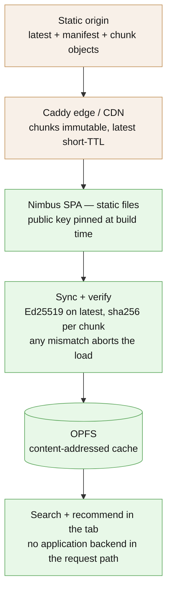
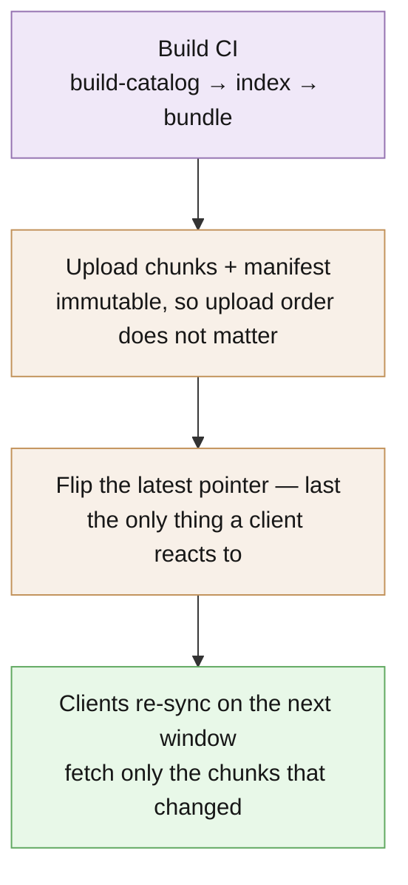

# Deploy

EdgeReco ships in two shapes. Pick the one that matches the request you want to answer:

| Shape | Where search runs | Who you serve from | When to use |
|---|---|---|---|
| **Backend-free, in-browser** | The user's tab | Any static HTTP / CDN | Public storefronts, low-latency UX, offline-capable, no app-server bill |
| **Edge-origin API server** | A FastAPI process at the edge | Your edge nodes / k8s / lambda | Server-side ranking, secret signal fusion, integrations that don't run in a browser |

Both deliver the same scoring; the bundle contract is identical.

## Shape 1 — Backend-free (the headline demo)



Architecture:

- A static **origin** holds the signed bundle (`latest` + `manifest/<hash>` + `chunk/<hash>` + `embeddings.f32` / `products.jsonl` / the Python FAISS artifact, plus the signed `ranking_config.json` scoring-weights + strategy map and the `cooccurrence.json` item-to-item neighbour map). The browser ignores the FAISS artifact and imports authenticated embedding rows into its SQLite-vector OPFS database.
- A **Caddy edge** fronts the origin with the right cache policy (immutable chunks + manifest, short-TTL pointer, permissive CORS).
- The **Nimbus SPA** is a static bundle. The browser pins a public key at build time, syncs the bundle into OPFS, verifies, then runs the engine in the tab.

There is **no application backend in the request path**. The browser does the work.

```yaml
# frontend/docker-compose.yml — abridged (omits the `name: nimbus-demo`
# project name and healthchecks; see the
# file itself for the full config). Modulo your TLS cert.
services:
  origin:
    image: python:3.13-slim
    volumes: ["../backend/examples/catalog:/catalog:ro"]
    command: ["python", "-m", "http.server", "8080"]

  edge:
    image: caddy:2-alpine
    ports: ["8081:8081"]
    volumes:
      - ../backend/deploy/caddy/Caddyfile:/etc/caddy/Caddyfile:ro

  frontend:
    build:
      context: .
      dockerfile: app/Dockerfile
      args:
        VITE_BUNDLE_BASE_URL: http://localhost:8081
    ports: ["5174:5174"]
```

For real production: replace the localhost ports with TLS + a real CDN in front of `origin/`. The browser only needs to reach the **edge** and trust the pinned public key.

### Caching policy (Caddy)

```caddyfile
:8081 {
    # /latest: short TTL (small file, must propagate fast)
    @latest path /latest
    header @latest Cache-Control "public, max-age=30, must-revalidate"

    # /manifest/* and /chunk/*: immutable (content-addressed)
    @immutable path /manifest/* /chunk/*
    header @immutable Cache-Control "public, max-age=31536000, immutable"

    # CORS for the browser sync
    header Access-Control-Allow-Origin "*"
    header Access-Control-Allow-Methods "GET, HEAD"

    file_server
}
```

A one-line edit to the index re-publishes one chunk; every consumer fetches one chunk and reuses the rest.

### Hosting the public demo on Cloudflare Pages (canonical)

The live demo at **https://edge-reco.com** is the backend-free shape served as plain
static files from Cloudflare Pages — no Caddy, no origin server. The build bundles the
signed catalog **same-origin** (copied into `dist/bundle`), so the whole app runs
from one domain with zero CORS and zero application backend.

Create the existing `edge-reco` Pages project in Cloudflare with this build config. The
production release authority is Dagger's checksum- and identity-verified Direct Upload;
do not disconnect an existing Cloudflare Git integration until the Dagger deployment is
green on hosted `main` and the exact live SHA has been independently verified:

| Setting | Value |
|---|---|
| Production branch | `main` |
| Root directory | `frontend` |
| Build command | `pnpm -F frontend run build:pages` |
| Build output directory | `app/dist` |
| Node version | from `frontend/.nvmrc` (24.16.0) — the single pin Dagger, deploy, and the local gate all install |

No build environment variables are required: `build:pages` defaults to `VITE_BASE=/`
(apex root) and `VITE_BUNDLE_BASE_URL=bundle` (the same-origin copy). The hosted demo
makes **zero backend calls after sync**, and the app has no code that sends shopper data
anywhere (`frontend/app/scripts/network-allowlist.test.mjs` fails the build otherwise). The
SPA has no client-side router (state-based Landing → Boot → Storefront), so no SPA
fallback / 404 rule is needed.

**The build also emits a service worker and a web app manifest**, making the storefront
an installable, offline-capable PWA. The service worker (Workbox via `vite-plugin-pwa`,
auto-update strategy) precaches the app shell. The embedding model (~23 MB) and the
ONNX wasm runtime are **self-hosted**: the build's `prebuild` hook mirrors them
(sha256-pinned) into `/models/` and `/ort/`, so the deployed site makes zero
third-party CDN fetches at runtime; offline, the model lives in transformers.js's
own browser cache and the runtime in the SW's runtime cache. Every mirrored file is
under Cloudflare Pages' 25 MiB single-asset limit (pinned by a preflight test). The
signed catalog bundle stays OPFS-owned — the service worker never caches it, so
ed25519 + sha256 integrity is unchanged.

A `frontend/app/public/_headers` file instructs Cloudflare Pages to serve `sw.js` and
`manifest.webmanifest` with `Cache-Control: max-age=0, must-revalidate`, so service
worker updates propagate immediately on the next page load. No extra Pages configuration
is required for offline support — it is on by default in the Pages build.

The same file serves `public.key` as `application/octet-stream` and caches the pinned
trust root, content-addressed bundle data, hashed Vite assets, and build-verified
model/ORT files as immutable release assets. A model rotation therefore requires a
versioned asset path plus an application release; silently replacing a file at one of
these stable paths is not a supported deployment operation. The trust root is the one
stable path whose *contents* may change, and only in an application release (see
[rotation](#signing-keys-the-release-sequence-and-rotation)): both of its readers — the
sync Worker's `loadTrustRoot` and the ranking-proof check — fetch it with
`cache: "no-store"`, so the year-long `immutable` header never serves them a stale copy,
and the service worker re-downloads it (bypassing the HTTP cache) whenever its precache
revision changes.

Then add the apex domain in the Pages project → **Custom domains** → `edge-reco.com`.
Cloudflare provisions the DNS record (CNAME-flattening at the apex) and the TLS
certificate automatically. Dagger builds and uploads the release after its exact `main`
SHA has passed the canonical gate.

> **Fork note:** to host your fork on a GitHub Pages *project* site instead (served
> under `https://<you>.github.io/<repo>/`), run the same `build:pages` with
> `VITE_BASE=/<repo>/` — the engine absolutizes the bundle + pinned-key URLs at
> runtime (`src/api/bundleUrl.ts`, `document.baseURI`), so one build works at any base.

### CI-driven deploy (GitHub Actions → Cloudflare Pages)

`.github/workflows/deploy.yml` is a privilege-separated trigger: pinned checkout plus
one pinned Dagger call. It accepts only a successful same-repository `main` push from
the protected Dagger workflow, checks out that run's exact `head_sha`, and passes the
exact triggering protected Dagger run SHA, run ID, and attempt to the typed deployment
function. Foundation binds the caller snapshot to complete Git history and runs the
shared guard before EdgeReco builds any product bytes. The central Cloudflare provider
then verifies the closed artifact envelope and revalidates that attempt as the latest
protected green `main` run before its credential preflight, direct upload, deployment
convergence, and EdgeReco's public live proof.

**It fails loudly when it cannot deploy.** Until the two repository secrets below
exist, the automatic deployment stops with a red failure before upload.

**It deploys only the commit that passed the protected gate and triggered this run.**
The checkout, caller snapshot, Foundation source identity, provider green-run evidence,
Wrangler commit hash, provider deployment evidence, and public `/build.json` must all
agree on that SHA. If a newer `main` run becomes the latest protected green attempt
before delivery reaches the provider boundary, the older attempt fails closed instead
of racing a newer release.

If the triggering attempt is not the latest successful same-repository Dagger push run,
the provider transaction fails closed before upload. The next successful main gate
creates its own deployment trigger, and serialized deploys never cancel an upload in
progress.

So a green run means Wrangler uploaded the exact Dagger-built directory, Cloudflare
reports a successful deployment whose `deployment_trigger.metadata.commit_hash`
matches the triggering protected SHA, and the public, no-store
`/build.json` artifact reports the same commit. The workflow does not depend on the incompatible Workers-style
`source.config.commit_hash` field.

To go live:

1. **Create the Pages project** (one-time, with a human running wrangler):

   ```bash
   npx wrangler pages project create edge-reco --production-branch=main
   ```

2. **Set the repository secrets** (Settings → Secrets and variables → Actions):

   | Secret | Value |
   |---|---|
   | `CLOUDFLARE_API_TOKEN` | a Cloudflare API token scoped **Pages: Edit** |
   | `CLOUDFLARE_ACCOUNT_ID` | the account that owns the `edge-reco` Pages project + the `edge-reco.com` zone |

   No bundle-signing key is needed in CI: this is the static SPA shape (the signed
   catalog is committed and copied same-origin by `build:pages`).

3. **Attach the apex domain** in the Pages project → **Custom domains** →
   `edge-reco.com`. Cloudflare provisions the apex DNS (CNAME-flattening) and TLS
   automatically.

4. **Make `www` canonical, not a second copy.** Attach `www.edge-reco.com` as a
   custom domain on this Pages project, alongside the apex. The checked-in advanced
   mode worker (`frontend/app/public/_worker.js`) redirects every `www` request to
   the apex with status 308 while preserving path and query strings. The deploy
   workflow probes `/faq?source=deploy-check` and fails unless `www` returns 301/308
   to the identical apex path and query.

The build emits a Dagger `Directory` from `frontend/app/dist`; pinned Wrangler receives
that exact directory mounted at `/artifact` and uploads it with the project, branch,
resolved SHA, and clean-tree identity flags. The
`frontend/app/public/_redirects` file intentionally has no SPA wildcard rewrite:
the storefront has no client-side URL router, and unknown paths should retain
the generated noindex 404 rather than serving the root shell.

Each Pages build also emits `/build.json` with the CI source commit, application
version, and signed catalog manifest hash. It is served with `Cache-Control:
no-store`; the deploy workflow compares its `commit` to the exact `EXPECTED_SHA`
passed from the protected triggering run after Cloudflare
reports the Pages deployment as successful. This gives a public,
machine-readable identity check without trusting a mutable README, an incompatible
Workers-style source field, or an unversioned bundle pointer.

The `www` → apex redirect intentionally lives in the Pages advanced-mode worker,
not `_redirects`: Pages `_redirects` cannot express a host-based redirect. The
worker has full control of requests, returns 308 only for the exact public `www`
hostname, and delegates all other traffic to `env.ASSETS.fetch(request)`. Keep the
deploy probe in place so a removed custom domain or worker regression cannot be
reported as canonical-host healthy.

Every Pages deployment has an immutable deployment URL, so rollback is the Cloudflare
Pages **Deployments → Rollback to this deployment** operation. After rollback, verify
the selected deployment's `/build.json` commit before announcing recovery; the next
CI-driven deploy repeats the same exact-SHA identity gate.

**Automatic rollback.** The deploy does this for you when the live site is broken.
Before uploading, `dagger call deploy` asks the shared `cloudflare-pages` module which
deployment production serves now (`previousProductionDeployment`, read-only). After
the upload it runs the live Playwright smoke (`tests/e2e-live/live.spec.ts`,
`--grep "@release|@fresh"`): `@release` checks `/build.json`, the signed bundle, the
model hashes and the `www` redirect for the exact commit; `@fresh` drives the demo in
a clean browser profile. The verdict is the Playwright exit code. If it is red, the
module's `rollback` puts the recorded deployment back, a recovery smoke (`@fresh`)
checks the restored site, and the workflow still fails with both outputs in the log.
A rollback is a recovery, never a green deploy.

One limit: browsers keep the highest bundle `sequence` they have accepted as an
anti-rollback floor (see below). If the failed release also shipped a new bundle, a
shopper who synced it during the few minutes before the rollback will refuse the
older bundle the restored deployment serves, until the next release publishes a
higher `sequence`. Fix forward with a new release in that case.

`.github/workflows/live-probe.yml` runs the same `@fresh` smoke against
https://edge-reco.com every 4 hours (`dagger call live-probe`, no credentials). A red
probe means the live site is broken for new visitors.

The canonical-host check is deliberately part of the green contract. If the custom
domain or worker redirect is missing or drifts, code can still upload, but the
workflow remains red and production must not be reported healthy.

## Shape 2 — Edge-origin API server

The same engine, but the **FastAPI runtime** does the search server-side. The SPA (or any client) calls `/search`, `/recommend`, `/catalog/info`. There is no event route.

```yaml
# backend/deploy/docker-compose.yml — server-side deployment
services:
  origin:
    image: python:3.13-slim
    volumes: ["../examples/catalog:/catalog:ro"]
    command: ["python", "-m", "http.server", "8080"]

  edge:
    image: caddy:2-alpine
    ports: ["8081:8081"]
    volumes: ["./caddy/Caddyfile:/etc/caddy/Caddyfile:ro"]

  demo:
    build:
      context: ..
      dockerfile: deploy/Dockerfile
    ports: ["8000:8000"]
    environment:
      EDGERECO_BUNDLE_BASE_URL: http://edge:8081
      EDGERECO_VERIFY_KEY_PATH: /app/examples/keys/public.key
```

The demo container syncs the signed bundle from `edge:8081` at startup, then serves search/recommend over `:8000`. CORS is configured for the storefront origin.

For multi-region: stamp the same container in each region; each replica syncs the bundle locally on cold start and serves recommendations from RAM. Bundle updates roll out by publishing a new `latest`; consumers pick it up on the next sync window (or on a signal).

### The server images and the embedding model

Both server images (`backend/deploy/Dockerfile` for `edgereco serve`, and
`backend/demo_server/Dockerfile` for the optional demo API server) embed queries in Python,
so they need the `sentence-transformers/all-MiniLM-L6-v2` weights. edge-proc never
downloads a model unless told it may. Both images set `EDGEPROC_ALLOW_MODEL_DOWNLOAD=1`,
so the first boot fetches the model from Hugging Face's `main` branch.

That fetch is **not pinned**. The images do not name a model commit or a digest,
because no upstream revision of that repository is recorded anywhere in this project to
pin against. (The browser tier's weights are pinned by sha256 in
`frontend/app/scripts/download-model.mjs`, but they are a different artifact: the
`Xenova/` ONNX export, not the PyTorch model the server loads.) A change on the model's
`main` branch would therefore reach a freshly started container unverified.

To run a server image with a pinned, verified model and no model egress:

1. On a build machine, download the model at a commit you have reviewed, for example
   `huggingface_hub.snapshot_download("sentence-transformers/all-MiniLM-L6-v2",
   revision="<commit sha>", local_dir="model")`.
2. Record its digest with edge-proc:
   `python -c "from pathlib import Path; from edgeproc.localvec.model_source import digest_model_dir; print(digest_model_dir(Path('model')))"`.
3. Ship that directory into the image or mount it, and set `EDGEPROC_MODEL_PATH` to it
   and `EDGEPROC_MODEL_DIGEST` to the digest. A path wins over the download opt-in, and
   a digest mismatch refuses to start (`bundle.integrity_failed`).

`backend/tests/integration/test_deploy_entrypoint.py` fails if an image declares no
model source, sets a model path without its digest, or opts into the download without
pointing here.

## Bundle lifecycle in production



Publisher (build CI):

```bash
set -euo pipefail
edgereco build-catalog new-products.csv staging/products.jsonl
# The build machine is the one place allowed to fetch the embedding model
# (edge-proc refuses to otherwise); or set EDGEPROC_MODEL_PATH to a local copy.
EDGEPROC_ALLOW_MODEL_DOWNLOAD=1 edgereco index staging staging
# A fresh CI checkout has no origin/latest, so read the sequence you serve now.
# Any failure (fetch error, no numeric integer `sequence`) stops the job here, before
# anything is signed: an empty read would otherwise make NEXT_SEQUENCE 1.
SEQ=$(curl -fsS https://cdn.example.com/products/latest \
    | jq -er '.sequence | select(type == "number" and . == floor and . >= 0)')
NEXT_SEQUENCE=$((SEQ + 1))
edgereco bundle staging origin examples/keys/private.key \
    --catalog-id products --version "$VERSION" --sequence "$NEXT_SEQUENCE"
aws s3 sync origin/ s3://my-bundle-bucket/products/ --delete-after-sync
```

`edgereco bundle` refuses a `--sequence` at or below the one `ORIGIN_DIR/latest` already
holds, and without `--sequence` it signs one more than that (1 on an empty dir). It can
only see the local `ORIGIN_DIR`, though, so a publisher that builds into a fresh
directory must pass the next sequence explicitly, as above. For the very first release
of a catalog, when nothing is served yet, pass `--sequence 1` instead of reading it.

It trusts a local `ORIGIN_DIR/latest` as that floor only when it is a regular file,
its `sequence` is a plain integer below 2^53, and it carries a valid signature by the
publishing key for this `--catalog-id`. Anything else is refused, not guessed past.
`--sequence` must be between 1 and 2^53 - 1. Publishers on one `ORIGIN_DIR` are
serialized by a lock file (`ORIGIN_DIR/.publish.lock`, removed on release) held from
that read to the `latest` write, so two of them can never sign the same sequence.

The pointer flip (`latest` upload) is the only thing the consumer reacts to. Chunks are immutable, so the order of upload doesn't matter as long as the pointer goes last.

## Security model

The trust boundary is **the pinned public key**:

- The SPA build embeds `frontend/app/public/public.key`. Replace it in your fork to bind your own trust root.
- The FastAPI runtime reads `EDGERECO_VERIFY_KEY_PATH` from env. Mount it as a secret.

Everything an attacker could swap (chunks, manifest, pointer) is verified locally. A forged pointer fails the signature check; a tampered chunk fails its content-address check. Both exit non-zero — `serve` refuses to start, the SPA shows a sync failure.

**Never ship the private key.** It signs on the publisher only.

### Signing keys, the release `sequence`, and rotation

Every signed `latest` pointer carries a `sequence` (`edgereco bundle --sequence N`,
which defaults to one more than the origin dir's current `latest` and refuses anything
at or below it). Each browser keeps the highest pointer it has
accepted as an **anti-rollback floor**, in OPFS and in IndexedDB. It keeps that floor
even when the currently pinned key can't verify the stored pointer, so a key change
can never be used to push an old release. That has three consequences for publishers:

- **`sequence` must strictly increase across keys, not just within one.** A new or
  regenerated key does not reset the counter. If `backend/examples/keys/private.key`
  is lost or regenerated, read the `sequence` from the `latest` pointer you are serving
  now (it is public), then publish with a larger one. A lower or equal `sequence` is
  refused as a rollback by every returning shopper, on every Retry.
- **Keep `bundle_id` and `channel` stable.** The stored pointer is bound to them, so
  changing either one also makes returning shoppers refuse the new release.
- **Rotate through an `edgeproc.keyring/v1` trust root, not by swapping `public.key`.**
  The browser's trust root (`frontend/app/public/public.key`) may be a raw 32-byte
  Ed25519 key or a JSON keyring:

  ```json
  {"schema": "edgeproc.keyring/v1",
   "keys": [{"key_id": "<first 16 hex of sha256(raw key)>", "public_key": "<64 hex>"}],
   "revoked": ["<key_id>", "..."]}
  ```

  Ship a keyring that lists both the old and the new key in an app release first. Then
  sign with the new key, using a higher `sequence`. Build that first new-key release into
  a fresh `ORIGIN_DIR` and pass `--sequence` explicitly: the publisher refuses to read
  a local `latest` signed by a different key as its floor. Revoke the old key id once every
  client has the new release. The sync Worker and the ranking-proof check both read the
  trust root with `@gainratio/browser`'s `parseTrustRoot`, and
  `frontend/app/scripts/trust-root-contract.test.mjs` fails the gate if the committed
  copies disagree or stop parsing. The optional Python/FastAPI tier
  (`EDGERECO_VERIFY_KEY_PATH`) still reads one
  raw key, so rotating that tier means swapping its key in step with the publisher.

#### Revocation lag: the service worker serves the trust root from its precache

`public.key` is precached by the service worker, because an offline reload has to start
the engine and the sync Worker fails closed without a trust root. A precached URL is
answered from the precache, even for a `cache: "no-store"` request. So a revocation
reaches a returning shopper only when their browser installs the service worker from
the release that ships the new keyring:

- **Online, returning shopper:** the first page load after the release is still served
  by the *old* service worker, with the *old* keyring. The new worker installs in the
  background (its precache fetches the changed `public.key` with `cache: "reload"`),
  activates, and — because the app registers it with `autoUpdate` — reloads the page,
  which then boots under the new keyring. If the shopper clicked **Launch** before that
  reload, that one boot trusts the revoked key.
- **Offline shopper:** keeps the old keyring until they are next online and the update
  installs. They cannot fetch a new catalog while offline either, so this only extends
  trust in the catalog already on the device.
- **First-time visitor:** no lag; there is no older service worker.

Why the precache is kept instead of a network-first route for `public.key`: Workbox
answers precached URLs before any runtime route, so a network-first route would mean
dropping the key from the precache. The key would then be cached only if the engine
happened to boot after the service worker took control of the page. A shopper who clicks
**Launch** during the first visit's install would get no cached key, and their offline
reload would refuse to start. That trades a guaranteed offline boot for a one-load
revocation window, and the live-user storage covenant rules out renaming the existing
caches to force a refresh. So the operational rule is: **revoke a key only when a
one-page-load lag for online shoppers is acceptable.** For an emergency (a leaked
private key), stop serving bundles signed by that key at the origin first, then ship
the revoking keyring. A returning shopper's old keyring can only accept a bundle that
is actually served.

If a shopper is stuck anyway, the boot screen offers **Clear cached catalog and retry**
for an integrity refusal. It clears only the synced catalog and its rollback floor:
the OPFS `chunk/`, `manifest/` and active-pointer files, plus the
`edgeproc-browser-cache` IndexedDB database. It then syncs again at first-install
trust. It never runs by itself. For a rollback refusal (the server offered an *older*
catalog than the one the browser already has, which is what tampering looks like) it
first shows a warning and asks for a second click. The service-worker caches, the
self-hosted model (`transformers-cache`), and the on-device taste log are left alone.

## Operational notes

- **Cold start**: the first sync downloads the full bundle (~10 MB for the demo catalog). Subsequent syncs only fetch chunks that changed.
- **Offline**: once synced, both tiers are fully offline-capable. The SPA keeps working with `origin` + `edge` down; the FastAPI runtime keeps serving from cache.
- **Shopper data**: none leaves the device. The SPA keeps the shopper's activity in a `taste_events` table in its own on-device SQLite database (`edgereco-user`) and never sends it anywhere; there is no event route, collector or retrain-from-events job to deploy. Popularity and the `cooccurrence.json` "also bought" map are set at publish time and shipped in the signed bundle.
- **Docker build context**: the demo_server `Dockerfile` builds with `backend/` as the context; uv resolves edge-proc/edgeproc-core from the release tags pinned in `uv.lock`, so no sibling checkout is sent to Docker. See its top comment.
